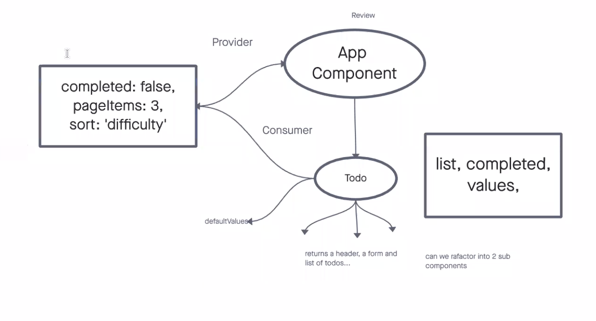
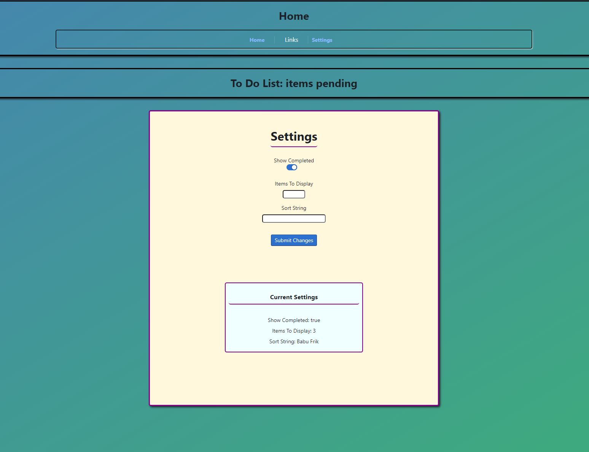

# Todo-App



## Challenge

For this week's labs, we are tasked with using starter code for a `todo` app and refactor it each day to meet certain requirements.  For these labs we will be using the following dependencies:

- `React`
- `@testing-library/react`
- `@blueprintjs/core`
- `react-bootstrap`
- `sass`
- `uuid`
- `react-router-dom`

## Lab 31 - Context

For this lab we were tasked with refactoring the starter code firstly by componentizing the app itself.  After this step, we introduced a new component that set up `context`.

### Instructions / Application Flow

1. Implement the React context API for defining settings across the entire application.
  - Create a `context` for managing application display settings and provide this at the application level.
  - Display or Hide completed items (boolean).
  - Number of items to display per screen (number).
  - Default sort field (string).
  - Manually set (hard code) those state settings in the context provider’s state, they should not be changeable.

2. Consume and utilize `context` values throughout your components
  - Show a maximum of a certain number of items per screen in the <List /> component
  - Provide “next” and “previous” links to let the users navigate a long list of items
  - Hide or show completed items in the list
  - Optional: Sort the items based on any of the keys (i.e. difficulty)

3. Only display the first `n` items in the list, where `n` is the number to display per screen in your context.
  - If you have more than `n` items in the list, add a button labeled Next that will replace the list with the next n items in the list.
  - If you are past the first `n` items (i.e. on page 2 or higher), add a button labeled Previous that will replace the list with the previous n items in the list.

For this lab the trickiest part was getting the algorithm converted to code for that last 3rd step.  I decided to leave the default `list` which was stored in state as an array, and create a function which returned at most 3 items per page based on the index position.  

Funcion:

```JavaScript
  const renderItems = () => {
    let items = [];
    let start = (settings.itemsToDisplay * page) - 3;
    let end = (settings.itemsToDisplay * page);
    if (list.length > settings.itemsToDisplay) {
      for (let i = start; i < end; i++) {
        items.push(list[i]);
      }
      return items;
    } else {
      return list;
    }
  }
```

As you can see, if the `list` array contained `n` items or less, the original array was returned.  If it contained more than `n` items, it would return the next set of values (up to `n`) based on the index positions of `start` and `end`.  These values were set based on which "page" the user was on, this was set in state by using the `next` and `previous` buttons.  The default was set to 1 so that the first 0-`n` items would always render.

Buttons
```JavaScript
   {list.length > (settings.itemsToDisplay * 2) || page > 1 ?
          <Button 
            type='click' 
            onClick={() => setPage(page - 1)} 
            className=' buttons bp4-intent-warning'
            disabled={page < 2 ? true : false}
            >Previous</Button> : null}
        {list.length > settings.itemsToDisplay ?
          <Button 
            type='click' 
            onClick={() => setPage(page + 1)} 
            className='buttons bp4-intent-success'
            disabled={list.length / page <= settings.itemsToDisplay ? true : false}
            >Next</Button> : null}
```

Here you can see the code for my two buttons.  The `next` button only renders if the list.length is greater than `n`.  It then gets disabled if a certain condition is met, in this case if list.length / page is less or equal to `n`.  
You can see the same logic is applied to the `previous` button as well.

## Testing

The testing for this lab was fairly straight forward.  

I chose to refactor and componentize first, making sure the app worked before I did any code, then again after my initial refactor was complete. 

After determining that it was working as intended, I introduced the `context` component.  To test this, I simply set up `index.js` as a consumer of the `context`.  I then imported it to my `list.js` and was able to confirm functionality by using a quick console.log.

### Global State

I set up global state in my `settings.js` file.  For this lab the state is hardcoded with no way to change it.  

Initial State and Provider component
```JavaScript
  export const SettingsContext = React.createContext();

function SettingsProvider({children}) {

  const state = {
    showCompleted: true, 
    itemsToDisplay: 3,
    sort: 'difficulty',

  }

  return (
    <SettingsContext.Provider value={state}>
      {children}
    </SettingsContext.Provider>
  )
}
```

Wrapping our `<App />` component with our `SettingsProvider`
```JavaScript
  class Main extends React.Component {
  render() {
    return (
      <SettingsProvider>
        <App />
      </SettingsProvider>
    );
  }
}
```

And finally, importing the `context` and using it with the `useContext` hook
```JavaScript
  const settings = useContext(SettingsContext);
```

### Custom `useForm` Hook

Hooks are, in essence, functions that let us "hook" into different parts of `React` functionality and behavior.  These can include `useState`, `useEffect`, and, `useContext`.

We can also make our own, custom hooks and that is what the author of our starter code did with the `useForm` hook.  

Is is a functional component that gives us access to several functions via the custom hook.  

This particular hook creates two new functions, and relies on the built in `useEffect` hook as well.  

See below:

```JavaScript
  const useForm = (callback, defaultValues={}) => {

  const [values, setValues] = useState({});

  const handleSubmit = (event) => {
    event.preventDefault();
    callback(values);
  };

  const handleChange = (event) => {
    event.persist();
    setValues(values => ({ ...values, [event.target.name]: event.target.value }));
  };

  useEffect( () => {
    setValues( defaultValues );
  }, defaultValues);
  
  return {
    handleChange,
    handleSubmit,
    values,
  };
};
```

## Lab 32

For this lab we continued off our work from the previous day and expanded on our application.  
The most noteworthy changes for this lab are:

- A new `form` that the user can use to change their settings
- Utilizing the `BrowserRouter` to make a path and link to the home and /settings pages
- Utilizing `localStorage` to store our settings.  

For that last item we set up our app so that on page load it looks first to `localStorage` and if there are any saved settings we load those first.  If not, then we stick with the defaults. 

Testing for all of this was relatively easy.  

- Made sure the new Settings.js component is consuming the SettingsContext correctly
- Make sure the form was working
- Make sure that `localStorage` was doing its job both in the storing, and the getting

All these tests were done from the console and by checking the functionality of the application

Here is an example of my code using `localStorage`

```JavaScript
  const getItems = () => {
    const savedItems = localStorage.getItem('items');
    const items = +JSON.parse(savedItems)
    if (items) setItemsToDisplay(items)
    else setItemsToDisplay(3);
  } 

  useEffect(() => {getItems()}, [])
```

I also set up the settings page to always render the current user settings so that the user can check them to see what they are _before_ changing them.  This also serves as excellent proof of life that my code is working as intended.  

